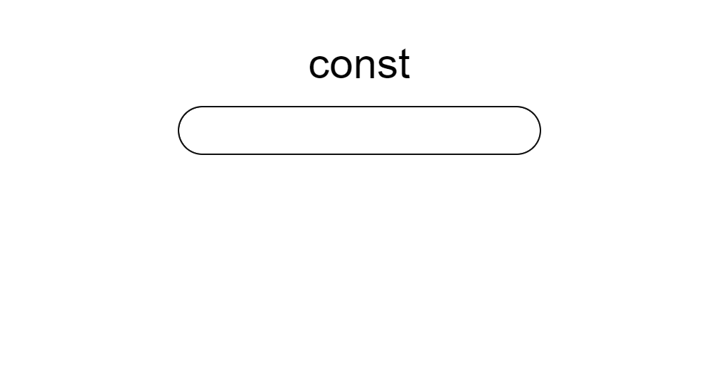

# タイピングゲーム作成演習

本演習用のフォルダ（js-typingフォルダ）を作成し、HTML/CSS、JavaScriptを使ってタイピングゲームを実装しましょう。なお、CSSとJavaScriptのファイルは外部ファイル化してください。

 

**＜イメージ＞**

  

タイピングゲームの仕様は基本的に自分で決めて結構です。どういったタイピングゲームだと使いやすいのか、学習しやすいのかを考えて仕様に盛り込んでみましょう。

仕様を1から考えるのが困難という人は、以下の仕様を参考、またはベースに作成してみましょう。

 

- 問題文（タイピングする文字列）は配列で保持する。
- 配列に格納されている問題文を表示する。順に出題でもよいが、ランダムに出題できるとベター。
- テキストボックスに入力した文字列と出題文が一致するかをチェックし、一致していれば次の問題文を表示する。
- 出題数は任意とする。
- 最後に入力時間や入力文字数、WPMを表示する。